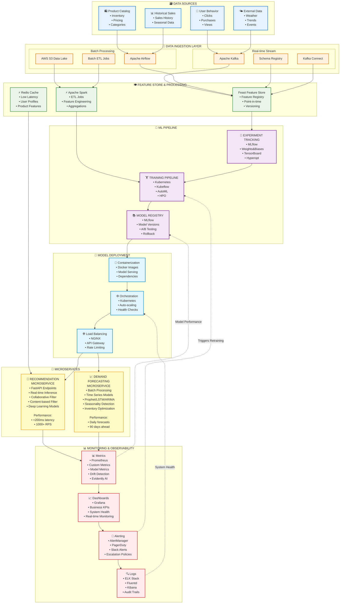
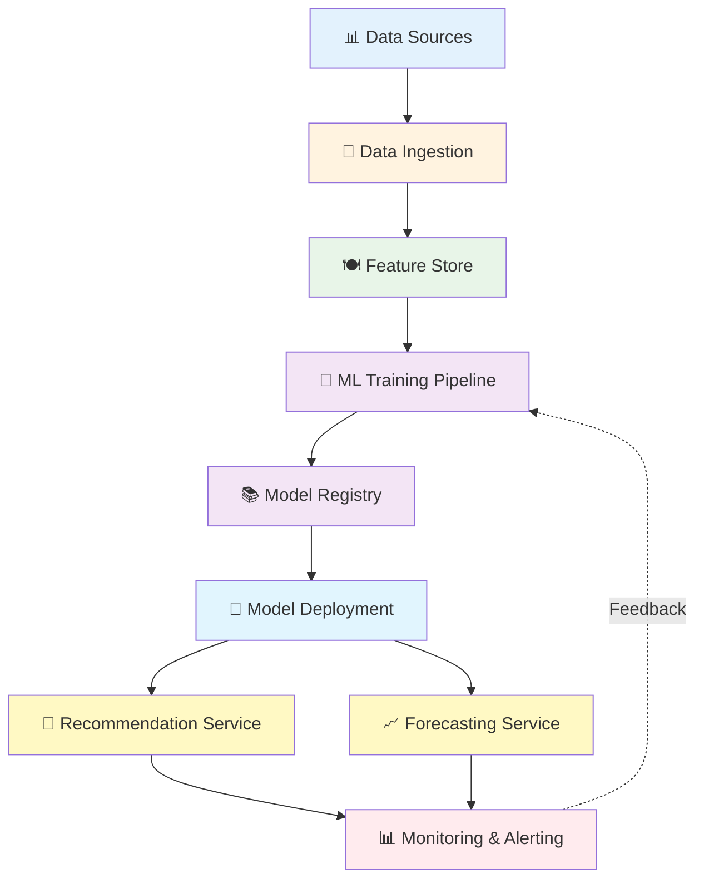
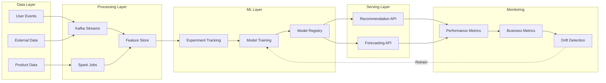

# MLOps Architecture - Mermaid Diagram Code

## Option 1: Complete System Overview



## Option 2: Simplified Architecture Flow



## Option 3: Detailed Component Relationships



## How to Use These Diagrams:

### **Option 1: Online Mermaid Editor**
1. Go to https://mermaid.live/
2. Paste any of the code blocks above
3. The diagram will render automatically
4. Export as PNG/SVG for your Word document

### **Option 2: GitHub/GitLab**
- Paste the code in a README.md file
- The diagram renders automatically in GitHub/GitLab

### **Option 3: VS Code Extension**
1. Install "Mermaid Preview" extension
2. Create a .md file with the mermaid code
3. Preview the diagram directly in VS Code

### **Option 4: Mermaid CLI (if you want local generation)**
```bash
npm install -g @mermaid-js/mermaid-cli
mmdc -i diagram.mmd -o diagram.png
```

### **Recommendation:**
Use **Option 1** (mermaid.live) - it's the quickest way to get a professional diagram for your assignment. Just copy-paste the code and export as high-resolution PNG!

The first diagram (Complete System Overview) is the most comprehensive and perfect for your MLOps assignment submission.